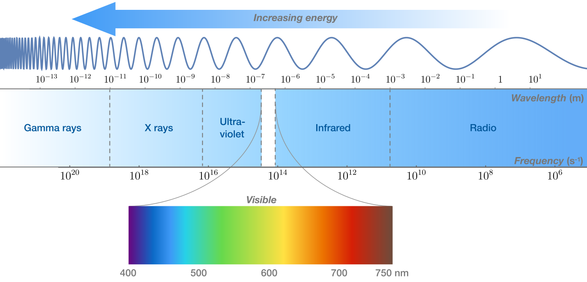

# Radiation

Radiation — traveling particles of matter and light—brings information about the universe to us. Radiation is a by-product of atomic and nuclear processes that carries away excess energy. The typically high speeds of radiation make it particularly useful for studying astronomical objects separated by astronomical distances. Visible light — and all types of electromagnetic radiation — travels through empty space at a rate of $c = 2.998 \times 10^8 \; m/s$.

## Electromagnetic Waves

All electromagnetic radiation moves away from a radiating source at the same speed, but that does not mean all light is identical.

Light has a wavelength — different wavelengths of light have different effects on matter. Wavelength is represented by the symbol $\lambda$. Altogether, the continuum of wavelengths is called the electromagnetic (EM) spectrum. Light can have a wavelength outside of the range humans can see. In fact, visible light is just a sliver of the entire EM spectrum.

All radiation is characterized by wavelength, with shorter wavelength indicating higher energy. In the 20th century, physicists measured wavelengths of matter particle radiation, like electrons. This is the starting point of quantum mechanics. You can read more about it in the [quantum mechanics section](/physics/quantum_physics/quantization/black_body_radiation.html).

Types of EM radiation — x-rays, ultraviolet, infrared, visible, and radio waves — are sometimes labeled by their wavelength. But they are just as often classified by frequency $f$ — the number of waves passing a point per second. Frequency relates to the period $t$, wavelength $\lambda$ and speed $v$ of a wave by the following

$$ f = \frac{c}{\lambda} = \frac{1}{t} $$

## Quantized Energy

The energy carried by EM radiation is delivered by massless particles called photons. Experiments show that the amount of energy carried by each photon is proportional to the radiation frequency $f$:

$$ E = hf $$ 

where $h$ is Planck's constant (An extremely small number which goes to show how microscopic the quantum world really is), $6.626 \times 10^{-34} \; Js$.

As an example, the tungsten filament in an incandescent light bulb emits visible light with wavelength $5 \times 10^{-7} \; m$. Then the amount of energy carried in a single visible photon would be

$$ E = hf = \frac{hc}{\lambda} = \frac{6.626 \times 10^{-34} \cdot 3.0 \times 10^8}{5 \times 10^{-7}} = 3.97 \times 10^{-19} \; J \; (3 sf) $$

## Thermal Emission Spectrum

A light bulb filament does not emit EM radiation at a single wavelength and frequency. Rather, it emits according to a distribution of wavelengths known as the tungsten filament's **thermal emission spectrum**.

Every object has a unique emission spectrum that depends on its atomic structure and temperature, but all known emission spectra have a peak wavelength that depends in a predictable way on temperature.

You can see that the peak of tungsten's spectrum is near yellow in the visible band.

Since $E = \frac{hc}{\lambda}$, this means that a photon with a lower wavelength carries more energy than one with a higher wavelength. So if we were to supply a greater current to the light bulb, we would see its peak wavelength shift left towards a blue colour. We can deduce that the peak wavelength of a material's thermical emission spectrum is inversely proportional to its temperature $T$

$$ \lambda_{max} = \frac{P_0}{T} $$

where the constant $P_0 = 0.0029 \; m \cdot K$. This is called Wien's displacement law.

This can be used to estimate the temperature of a surface given its thermal emission spectrum.

For example, here is the Sun's emission spectrum. It has a peak wavelength of about $5 \times 10^{-7} \; m$, similar to Tungsten. Thus, we can estimate the surface temperature of the Sun

$$ T = \frac{P_0}{\lambda_{max}} = \frac{0.0029}{5 \times 10^{-7}} = 5800 \; K $$

## Luminosity

The Sun is an energy powerhouse. The fundamental astrophysical quantity L_\odot is called the Sun's luminosity. By our best measurements, the Sun emits energy at a rate of

$$ L_\odot = 3.83 \times 10^{26} \; W $$

Most of the radiation emitted by the Sun is in the form of photons. Given its luminosity, we can calculate how many photons are emitted every second to be

$$ N_{photon} = \frac{3.83 \times 10^{26}}{3.97 \times 10^{-19}} = 9.85 \times 10^{44} \; (3 sf) $$

Because so many photons are escaping the Sun's surface each second, equal surface areas emit equal energy each second as long as they are at the same temperature. As a result, the luminosity of a star depends on its temperature and its surface area. An estimate of how much power is radiated by a star with temperature $T$ and area $A$ is contained in **Stefan's law**

$$ L = \sigma A T^4 $$

where the constant $\sigma = 5.67 \times 10^{-8} \; W \; m^{-2} \; K^{-4}$. This means that a larger star with higher temperatures would have higher luminosity. Since $\lambda_{blue} < \lambda_{yellow} < \lambda_{red}$, blue stars have higher luminosity than yellow and red stars of the same size.

## Hertzsprung-Russell Diagram

In the early 20th century Ejnar Hertzsprung and Henry Norris Russel extracted these data from the spectra of many stars in the Pleiades Cluster. Expecting a relationship between $L$ and $T$, they decided to plot luminosity against peak wavelength and noticed that most of the stars (the main sequence) fell roughly on a line.

Note that the luminosity axis is logarithmic and scaled by the luminosity of the Sun.

Using Wien's displacement law, astronomers have plotted the luminosity of thousands of stars against their surface temperatures. They discovered that most stars fall on a line of stars running from the top left to bottom right of the diagram—so-called main sequence stars, including our Sun.

However, some stars do not fall on the main sequence. For example, Red Giants has very different properties.
